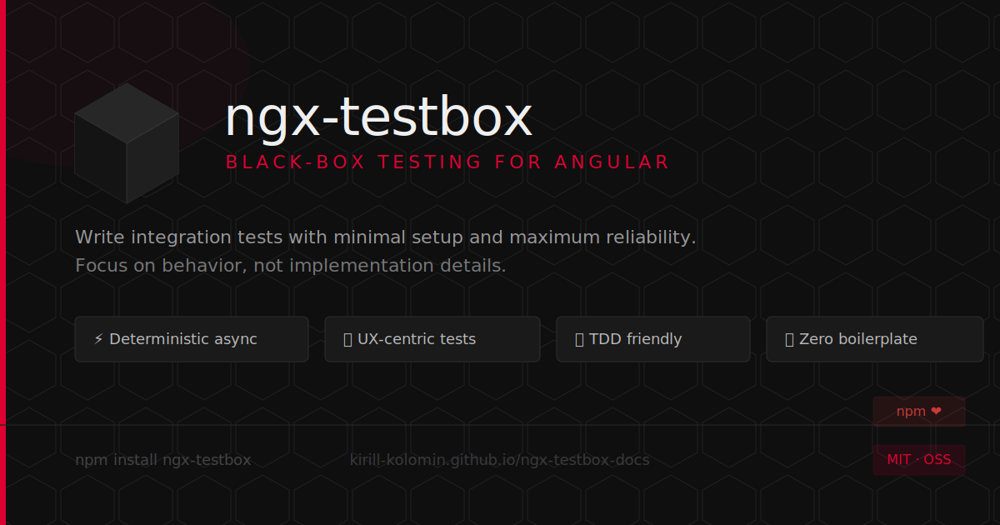

# 

# ngx-testbox Agent Skill

`ngx-testbox-agent-skill` is an agent skill for Angular integration testing with `ngx-testbox`.

It helps AI coding agents create, review, debug, and refactor black-box Angular tests that use:

- `runTasksUntilStableAsync`
- `runTasksUntilStable`
- `DebugElementHarness`
- `testboxTestId`
- predefined HTTP call instructions

## Install

Use `skillpm` directly with `npx`:

```bash
npx skillpm install ngx-testbox-agent-skill
```

Requirements:

- Node.js 18 or later

After installation, verify the skill is available:

```bash
skillpm list
```

`skillpm` installs the package as a normal workspace dependency, scans for installed skills, and links discovered skills into supported agent directories.

## What This Skill Does

Use this skill when an agent is working on Angular tests that use `ngx-testbox` or should be converted to its black-box integration testing style.

The guidance is focused on:

- choosing the right stabilization mode
- writing maintainable integration-style tests
- driving tests through harness interactions and DOM assertions
- handling HTTP request flows with explicit instructions
- debugging timing, cancellation, and fixture stabilization issues

The default recommendations align with the shipped skill docs:

- prefer `runTasksUntilStableAsync` for new tests
- use `runTasksUntilStable` in existing `fakeAsync` or zone-based suites
- avoid mixing `ngx-testbox` stabilization with direct `HttpTestingController.expectOne(...)` flows unless deliberately debugging at a lower level

## Package Structure

This package contains one skill under `skills/ngx-testbox/`.

```text
skills/
  ngx-testbox/
    SKILL.md
    quick-reference.md
    testing.md
    async-approach.md
    sync-fakeasync-approach.md
    concepts.md
    examples.md
    api-modes.md
```

Main files:

- `skills/ngx-testbox/SKILL.md`: skill definition and entry point
- `skills/ngx-testbox/quick-reference.md`: condensed rules and defaults
- `skills/ngx-testbox/testing.md`: setup, harness workflow, and troubleshooting
- `skills/ngx-testbox/async-approach.md`: async mode guidance
- `skills/ngx-testbox/sync-fakeasync-approach.md`: sync `fakeAsync` guidance
- `skills/ngx-testbox/concepts.md`: core concepts and decision rules
- `skills/ngx-testbox/examples.md`: reusable patterns and snippets
- `skills/ngx-testbox/api-modes.md`: mode-specific API details

## Agent Skill Metadata

The skill entry point is:

```text
skills/ngx-testbox/SKILL.md
```

The skill metadata declares compatibility with:

- `ngx-testbox >=2.0.0`
- Angular `>=9.0.0`

The skill name in frontmatter is `ngx-testbox` and matches the skill directory name, as required by the Agent Skills packaging conventions.

## When To Use It

This skill is useful when the task involves:

- creating Angular integration tests with `ngx-testbox`
- fixing brittle or timing-sensitive component tests
- migrating tests toward black-box patterns
- deciding between async and sync stabilization APIs
- working with `DebugElementHarness` and test IDs
- modeling HTTP timing, delays, cancellations, and intermediate assertions

## Repository

- Homepage: <https://github.com/kirill-kolomin/ngx-testbox-agent-skill#readme>
- Issues: <https://github.com/kirill-kolomin/ngx-testbox-agent-skill/issues>
- Ngx-testbox: <https://github.com/kirill-kolomin/ngx-testbox#readme>

## License

MIT
